

  

  <h3 align="center">Compras USA</h3>

  

    Trabalho de conclusão do curso de iOS
     
     
    FIAP - MBA - MOBILE DEVELOPMENT
     
    APPS, IOT, CHATBOTS & VIRTUAL ASSISTANTS
     
    <a href="https://github.com/helton-isac/HeltonHeltonLyanRicardo/issues/new?template=bug.md">Report bug</a>
    ·
    <a href="https://github.com/helton-isac/HeltonHeltonLyanRicardo/issues/new?template=feature.md&labels=feature">Request feature</a>
  

## Indice

- [Integrantes](#integrantes)
- [Professor](#professor)
- [Desafio](#desafio)
- [Demonstração](#demonstração)
- [Freepik](#freepik)

## Integrantes
- [Helton Isac](https://github.com/helton-isac)
- [Helton Souza](https://github.com/heltonss)
- [Lyan Masterson](https://github.com/lyanmaster)
- [Ricardo Kerr](https://github.com/RicardoKerr)

## Professor
- [Eric Alves Brito](https://github.com/ericalvesbrito)

## Desafio

Descrição do Aplicativo a ser desenvolvido:

Você deverá criar um App (somente Portrait e iPhones) onde o usuário irá cadastrar produtos que comprou nos Estados Unidos e poderá ver quanto irá gastar, em Reais, levando em conta os impostos do estado onde o produto foi comprado e o IOF caso tenha comprado o produto no cartão de crédito.

## Demonstração

| Navegação em Tabs                                | Adição de produtos 01                           | Adição de produtos 02                           |
| :----------------------------------------------: | :---------------------------------------------: | :---------------------------------------------: |
|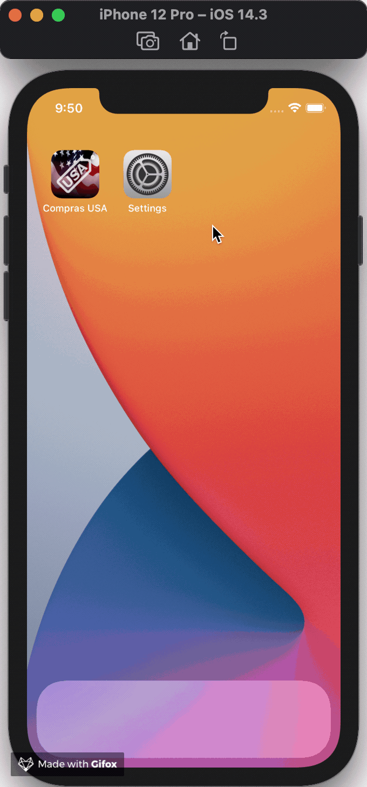|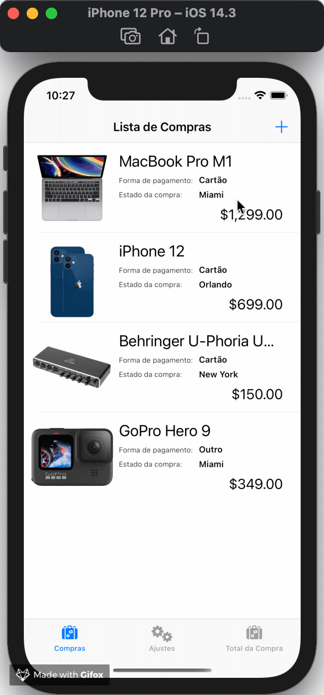|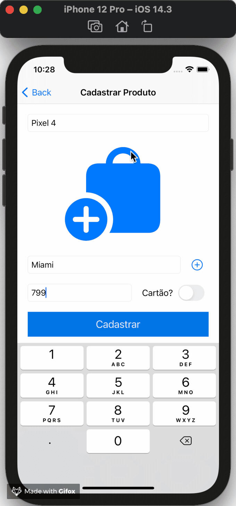|

| Validação de Dados 01                           | Validação de Dados 02                           | Deleção de Produto                               |
| :---------------------------------------------: | :---------------------------------------------: | :----------------------------------------------: |
|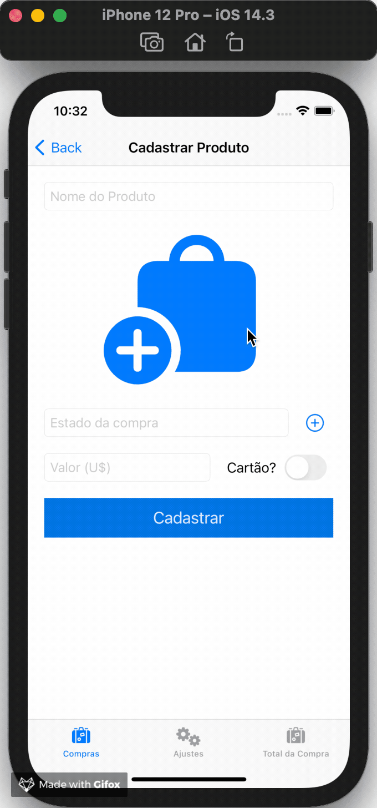|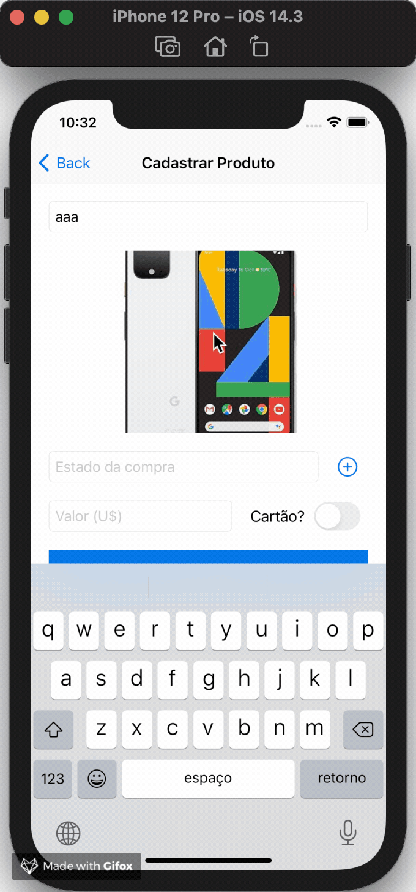||

| Adição de Estado (Tela de Settings)           | Adição de Estado (Tela de Produto)            | Deleção de Estado                              | 
| :-------------------------------------------: | :-------------------------------------------: | :--------------------------------------------: |
|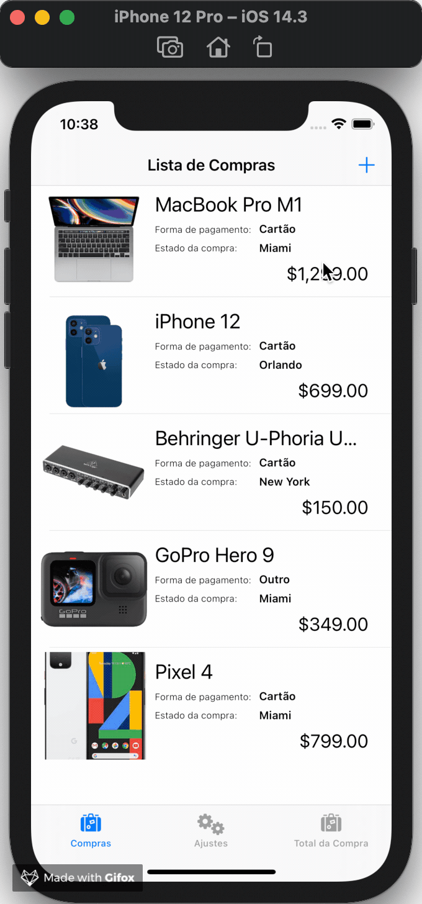|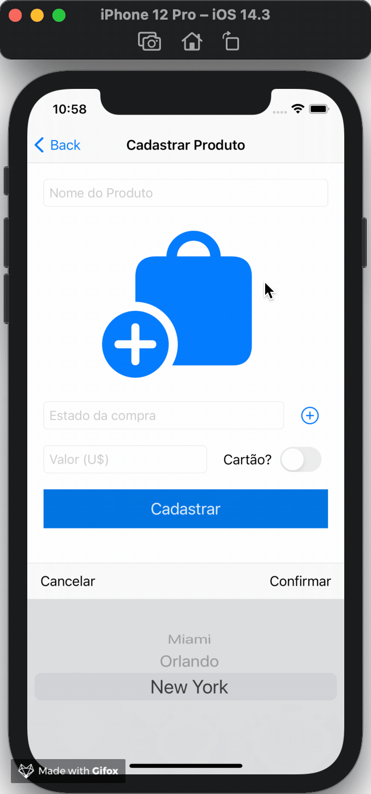|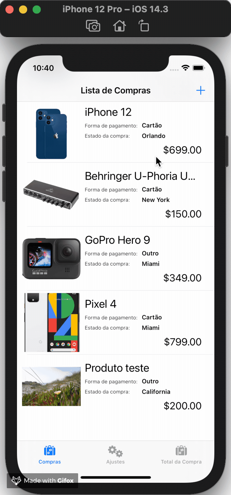|

| Alterando Cotação do Dolar                         | Alterando IOF                                | Splash                                    |
| :------------------------------------------------: | :------------------------------------------: | :---------------------------------------: |
|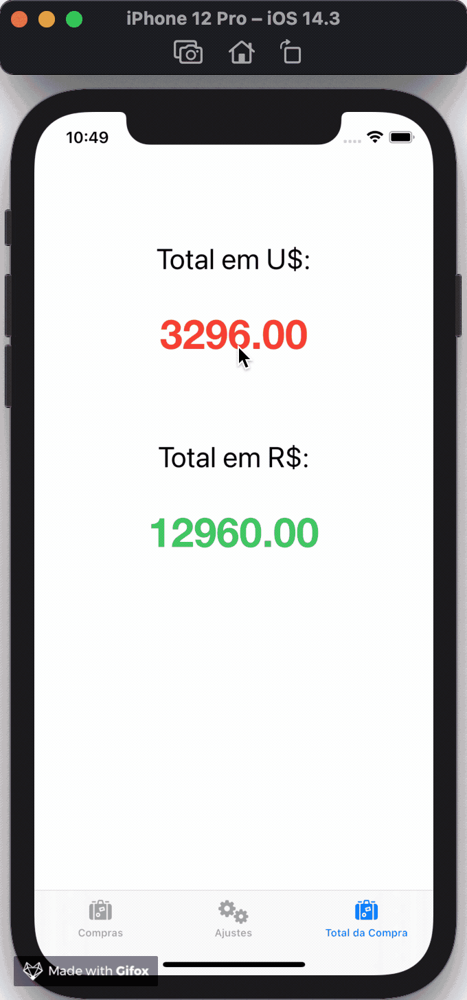|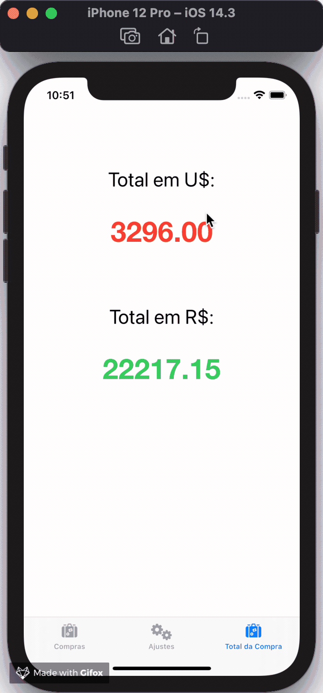|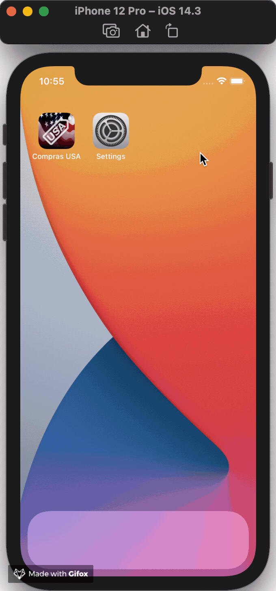|

## Freepik

Icons made by <a href="https://www.flaticon.com/authors/freepik" title="Freepik">Freepik</a> from <a href="https://www.flaticon.com/" title="Flaticon">www.flaticon.com</a>
